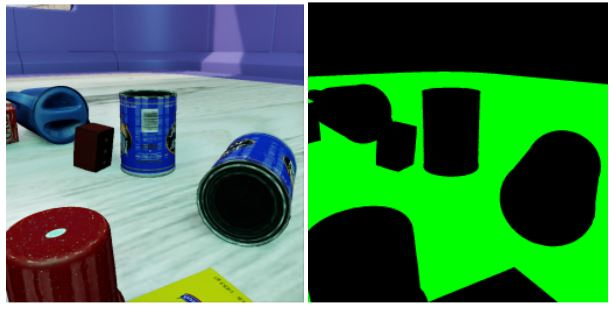
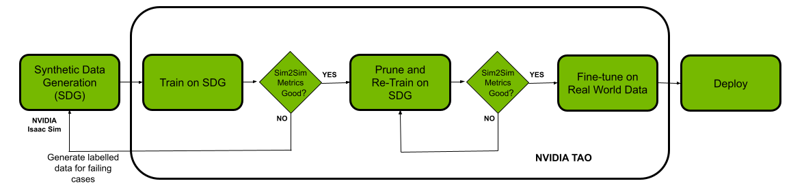
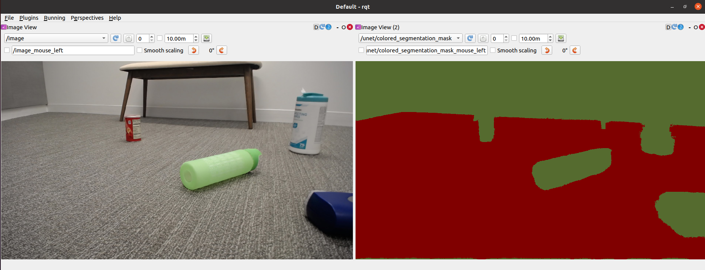

# Freespace Segmentation

This project provides a workflow for using NVIDIA's Isaac Sim, TAO and IsaacROS for deploying a freespace segmentation model on a Jetson powered robot.

### Follow the Jupyter Notebook `freespace_segmentation.ipynb` for understanding all the steps involved in the project

## Components of the Workflow:
- [NVIDIA Isaac Sim](https://developer.nvidia.com/isaac-sim) to generate labeled synthetic segmentation data
- [NVIDIA TAO toolkit](https://developer.nvidia.com/tao-toolkit) to perform training , pruning, and post training quantization (PTQ) optimizations.
- [NVIDIA Isaac ROS](https://github.com/NVIDIA-ISAAC-ROS) to deploy optimized model on robots

## What this project includes:
- Scripts for generating synthetic data using Isaac Sim:
      - Domain Randomization for position and scale objects and the lighting of the simulated environment, the color and texture of objects and more.
      - Using two different environments from Isaac Sim to generalize the model.
- Jupyter Notebook for entire workflow: Synthetic Data Generation followed by TAO toolkit train, prune, and PTQ (INT8) optimizations.
- Guide to deploy optimized trained model on Jetson powered robot. 

## What this project does not include:
- Dataset for freespace segmentation
- Trained model for freespace segmentation (we will go through step by step to produce a trained and optimized model)

## Overall Workflow

### IsaacSim Workflow  
1. Run the scripts to generate data from `simple_room` and `full_warehouse` sample environments.
2. Postprocess the semantic segmentation masks for compatibility with TAO.

### TAO Workflow  
1. Download the Pre-trained model (For Semantic Segmentation we will use the PeopleSemSegNet model as a starting point.)
2. Ensure data from IsaacSim is in the correct directory for TAO.
3. Train Model (tao-train)
4. Evaluate on synthetic validation data or infer on test images (tao-evaluate,  tao-infer)
5. Prune trained model (tao-prune) 
   Pruning model will help you to reduce parameter count thus improving FPS performance
6. Retrain pruned model (tao-train)
7. Evaluate re-trained model on synthetic validation data (tao-evaluate)
8. If accuracy does not fall below satisfactory range in (7); perform step (5), (6), (7); else go to step (9)
9. Fine tune the model on real world data.
10. Export trained model from step (6) (tao-export) 
   Choose int8, fp16 based on you platform needs; such as Jetson Xavier and Jetson Xavier-NX has int8 DLA support

### Deployment with IsaacROS  
1. Copy the trained model to Jetson and use `tao-converter` to generate the engine file(int8 or fp16)
2. Follow the walkthrough for IsaacROS Image Segmentation. 

